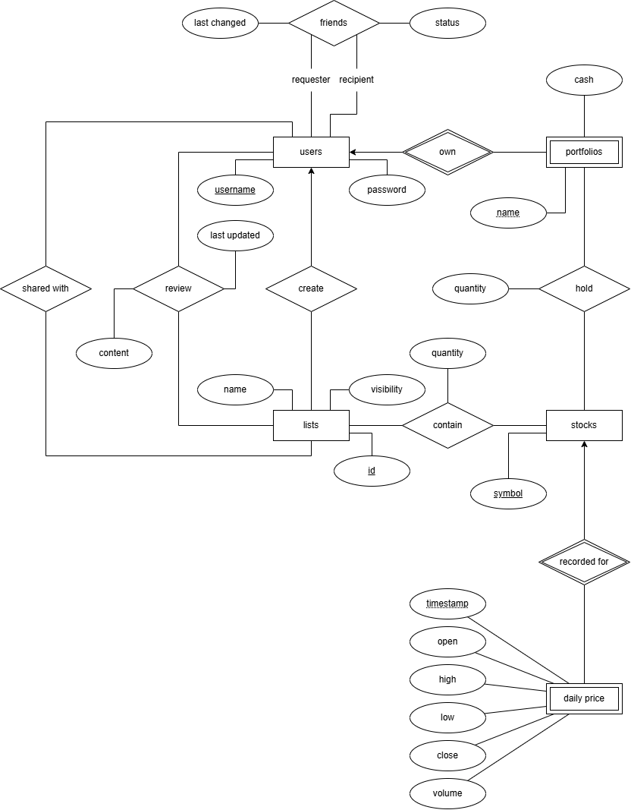

# Project Written Tasks

## Task 1 - E/R Modeling

### Note the following:

- Passwords are not stored in the database, only their salted hashes
- Sharing of lists is allowed only between friends
- A list creator can review their own list
- Friend status could be one of: pending, accepted, rejected, removed
- Users must name their portfolios uniquely
- New daily stock information goes in the same entity as the historical data

## Task 2 - Relational Schema

### Entities

**users**(<u>username</u>, password)

**portfolios**(<u>username</u>, <u>name</u>, cash)\
Foreign Key: username references users(username), on delete cascade

**stocks**(<u>symbol</u>)

**daily_prices**(<u>symbol</u>, <u>timestamp</u>, open, high, low, close, volume)\
Foreign Key: symbol references stocks(symbol), on delete cascade

**lists**(<u>id</u>, creator, name, visibility)\
Foreign Key: creator references users(username), on delete cascade

### Relationships

**friends**(<u>requester</u>, <u>recipient</u>, status, last_changed)\
Foreign Key: requester references users(username), on delete cascade\
Foreign Key: recipient references users(username), on delete cascade

**holds**(<u>username</u>, <u>portfolio_name</u>, <u>symbol</u>, quantity)\
Foreign Key: (username, portfolio_name) references portfolios(username, name), on delete cascade\
Foreign Key: symbol references stocks(symbol)

**contains**(<u>list_id</u>, <u>symbol</u>, quantity)\
Foreign Key: list_id references lists(id), on delete cascade\
Foreign Key: symbol references stocks(symbol)

**reviews**(<u>list_id</u>, <u>username</u>, content, last_updated)\
Foreign Key: list_id references lists(id), on delete cascade\
Foreign Key: username references users(username), on delete cascade

**shared_with**(<u>list_id</u>, <u>username</u>)\
Foreign Key: list_id references lists(id), on delete cascade\
Foreign Key: username references users(username), on delete cascade

### Caching Tables

Not in the ERD since these are derived data and not entities. These tables only cache already computed results to save processing time.

**stock_stats**(<u>symbol</u>, <u>start_date</u>, <u>end_date</u>, cov, beta)\
Foreign Key: symbol references stocks(symbol), on delete cascade

**pair_stats**(<u>symbol1</u>, <u>symbol2</u>, <u>start_date</u>, <u>end_date</u>, covariance, correlation)\
Foreign Key: symbol1 references stocks(symbol), on delete cascade\
Foreign Key: symbol2 references stocks(symbol), on delete cascade

### Note the following:

- If A and B appear as (requester, recipient) in the _friends_ table, then (B, A) will not appear (no duplicates allowed)
- Similarly, if stocks A and B are a pair in the _pair_stats_ table, then they will be sorted lexicographically (preventing duplicates)
